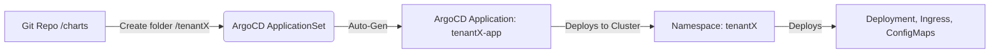

# Day 3 Lab Guide: GitOps Multi-Tenancy with Argo CD ApplicationSets

In this lab, you will configure an Argo CD `ApplicationSet` using a directory generator. This allows provisioning a completely isolated tenant infrastructure namespace simply by committing files to Git.

---

## 🔁 GitOps Directory Generator Flow


---

## 🛠️ Task: Implement the ApplicationSet Manifest

Create a file named `gitops/argo-applicationset.yaml` and paste the following manifest:

```yaml
apiVersion: argoproj.io/v1alpha1
kind: ApplicationSet
metadata:
  name: tenant-applicationset
  namespace: argocd
spec:
  # 1. Directory Generator: Scans git repository for matching folders
  generators:
    - matrix:
        generators:
          - git:
              repoURL: 'https://github.com/your-username/grant-explorer-deploy.git'
              revision: HEAD
              directories:
                # Scans every subfolder in the 'charts' directory (e.g. charts/tenant1, charts/tenant2)
                - path: charts/*
  template:
    metadata:
      # Creates individual application named after the tenant subfolder (e.g., tenant1-app)
      name: '{{path.basename}}-app'
    spec:
      project: default
      source:
        repoURL: 'https://github.com/your-username/grant-explorer-deploy.git'
        targetRevision: HEAD
        # Points to the exact subdirectory of the chart (e.g., charts/tenant1)
        path: '{{path}}'
      destination:
        # Deploys to the cluster where Argo CD is running
        server: https://kubernetes.default.svc
        # Automates isolation: deploys the tenant into their own namespace (e.g., tenant1)
        namespace: '{{path.basename}}'
      syncPolicy:
        automated:
          prune: true      # Automatically delete resources if they are removed from Git
          selfHeal: true   # Automatically revert manual alterations made to Kubernetes resources
        createNamespace: true # Automatically create the tenant namespace if it does not exist
```

---

## 🧪 Verification & Testing
1. Apply the manifest to your cluster:
   ```bash
   kubectl apply -f gitops/argo-applicationset.yaml
   ```
2. Create a new directory under `charts/tenant2/`, configure its `values.yaml`, and push it to Git.
3. Open the Argo CD dashboard and watch a new application named `tenant2-app` get automatically provisioned, creating a dedicated `tenant2` namespace on the cluster.
