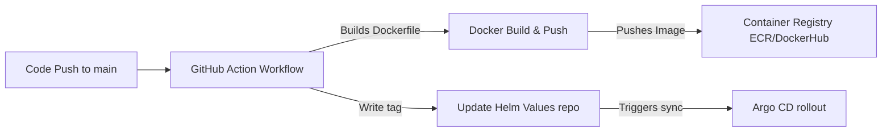

# Day 3 Lab Guide: Automated CI/CD Pipelines with GitHub Actions

In this lab, you will configure a **GitHub Actions CI/CD pipeline** to close the feedback loop between code modifications (in Next.js or Lovable exports) and your Kubernetes GitOps repository.

---

## 🔁 The CI/CD Loop



---

## 🛠️ Task 1: Create the GitHub Actions Workflow

Create a file named `.github/workflows/deploy.yml` in your Next.js application repository:

```yaml
name: CI/CD Docker Build & GitOps Tag Update

on:
  push:
    branches:
      - main

jobs:
  build-and-push:
    runs-on: ubuntu-latest

    steps:
      # 1. Checkout Application Code
      - name: Checkout Code
        uses: actions/checkout@v4

      # 2. Login to Docker Hub (or AWS ECR)
      - name: Log in to Docker Registry
        uses: docker/login-action@v3
        with:
          username: ${{ secrets.DOCKER_USERNAME }}
          password: ${{ secrets.DOCKER_PASSWORD }}

      # 3. Build & Push Docker Image (Tagged with git SHA)
      - name: Build and Push Docker Image
        uses: docker/build-push-action@v5
        with:
          context: .
          push: true
          tags: |
            docker.io/${{ secrets.DOCKER_USERNAME }}/nextjs-saas:${{ github.sha }}
            docker.io/${{ secrets.DOCKER_USERNAME }}/nextjs-saas:latest

      # 4. Checkout GitOps Infrastructure Repository
      - name: Checkout GitOps Repo
        uses: actions/checkout@v4
        with:
          repository: 'your-username/grant-explorer-deploy'
          token: ${{ secrets.GITOPS_REPO_TOKEN }} # Github Personal Access Token (PAT)
          path: 'gitops-repo'

      # 5. Update the Helm image.tag in GitOps Repo values.yaml
      - name: Update Tag in GitOps values
        run: |
          cd gitops-repo
          # Use yq (YAML parser tool available on github runners) to replace the tag value
          yq -i '.image.tag = "${{ github.sha }}"' charts/tenant-app/values.yaml
          
          # Configure Git credentials
          git config user.name "GitHub Actions"
          git config user.email "actions@github.com"
          
          # Commit and Push
          git add .
          git commit -m "Auto-promoted image version to ${{ github.sha }} [skip ci]"
          git push origin main
```

---

## 🛠️ Task 2: Configure Secrets in GitHub
In your GitHub Repository, navigate to **Settings > Secrets and variables > Actions** and add:
1. `DOCKER_USERNAME`: Your Docker registry account username.
2. `DOCKER_PASSWORD`: Your Docker registry access token/password.
3. `GITOPS_REPO_TOKEN`: A Personal Access Token (PAT) with write permissions to your deployment repository.

---

## 🧪 Verification & Testing
1. Modify a text field in your frontend application (e.g. change a heading or background color).
2. Commit and push the change to `main`.
3. Check the **Actions** tab in GitHub to watch the build pipeline run.
4. Verify the deployment repository is automatically updated with the new commit tag.
5. Watch Argo CD detect the change, automatically pull the new container tag, and run the rolling update!
