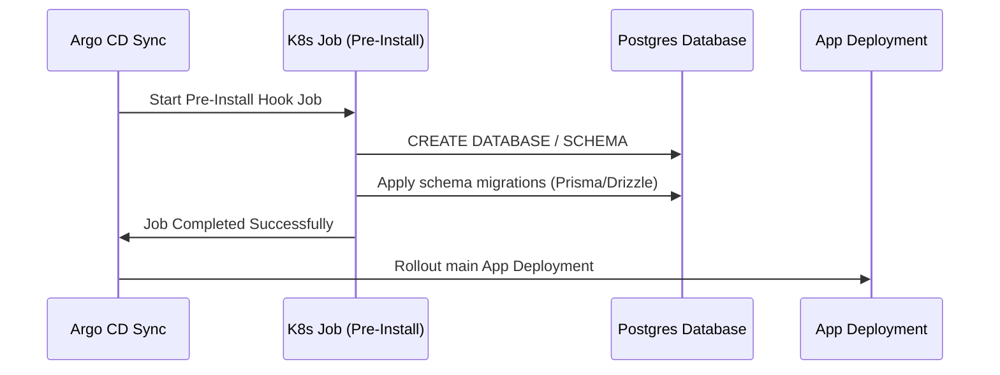

# Day 3 Lab Guide: Automating Database Migrations with Helm Hooks

In this lab, you will configure Helm Lifecycle Hooks to dynamically create databases/schemas and run database migrations (such as Prisma or Drizzle) before a new tenant's application pods start running.

---

## 🛠️ The Architecture
To avoid spinning up separate Postgres instances per tenant, all tenants share a central PostgreSQL service. However, to isolate data:
1. Every tenant gets a dedicated PostgreSQL database name or schema (e.g. `tenant1_db`).
2. When a new release is installed, a temporary Kubernetes **Job** runs first.
3. This Job connects to the PostgreSQL database, creates the new database schema (if not exists), and runs migrations.
4. Once the Job finishes successfully, the main application deployment begins rollout.



---

## 🛠️ Task 1: Create the Helm Hook Job Template

Create a file named `charts/tenant-app/templates/db-migration-job.yaml`:

```yaml
apiVersion: batch/v1
kind: Job
metadata:
  name: {{ .Release.Name }}-db-migrate
  namespace: {{ .Release.Namespace }}
  annotations:
    # 1. This instructs Helm to run this job BEFORE updating/installing pods
    "helm.sh/hook": pre-install,pre-upgrade
    # 2. This deletes the job after it completes to prevent job collision next run
    "helm.sh/hook-delete-policy": hook-succeeded,before-hook-creation
spec:
  template:
    spec:
      restartPolicy: OnFailure
      containers:
        - name: db-migrator
          # Docker image containing your ORM tool and schema files
          image: "{{ .Values.image.repository }}:{{ .Values.image.tag }}"
          # Overwrite start command to run migration scripts
          command: ["sh", "-c"]
          args:
            # Step A: Connect to main server and ensure tenant database/schema exists
            # Step B: Run ORM migrations (e.g., Prisma db push / migrate deploy)
            - |
              echo "Ensuring schema exists..."
              npx prisma db push --accept-data-loss
          env:
            - name: DATABASE_URL
              valueFrom:
                secretKeyRef:
                  name: {{ .Release.Name }}-secrets
                  key: DATABASE_URL
```

---

## 🛠️ Task 2: Configure App Pod Readiness
To ensure Next.js pods don't connect to a database that is still migrating, configure a `readinessProbe` in `charts/tenant-app/templates/deployment.yaml`:

```yaml
spec:
  containers:
    - name: app-container
      image: "{{ .Values.image.repository }}:{{ .Values.image.tag }}"
      readinessProbe:
        httpGet:
          path: /api/health
          port: 80
        initialDelaySeconds: 15
        periodSeconds: 5
```

---

## 🧪 Verification & Testing
1. Push your changes to Git.
2. In Argo CD, sync the application.
3. Observe the `Sync Phases` in Argo CD:
   * The `-db-migrate` Job is instantiated first.
   * Check the pod logs for the job to confirm schema creation.
   * Once the Job succeeds, the deployment rollout begins.
