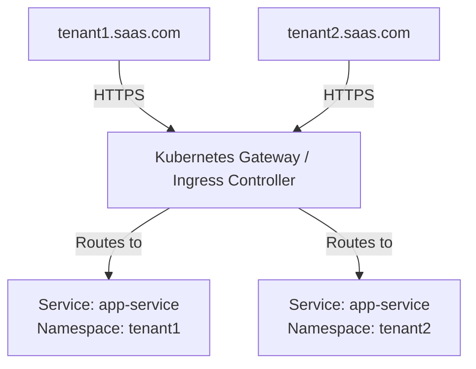

# Day 3 Lab Guide: Kubernetes Ingress & Gateway API Routing for Multi-Tenancy

In this lab, you will configure Kubernetes routing (Ingress / Gateway API) to map client subdomains directly to isolated tenant services deployed across different namespaces.

---

## 🗺️ Routing Architecture
Because **Kubernetes and Argo CD handle the multi-tenancy**, the application code does not need complex subdomain-routing logic. 



Every tenant is deployed into an isolated namespace, and the Ingress/Gateway resource dynamically routes traffic based on the HTTP Host header.

---

## 🛠️ Option A: Standard Ingress Pattern (Helm Templating)

Create an Ingress template `charts/tenant-app/templates/ingress.yaml` that renders dynamically for each tenant:

```yaml
{{- if .Values.ingress.enabled -}}
apiVersion: networking.k8s.io/v1
kind: Ingress
metadata:
  name: {{ .Release.Name }}-ingress
  namespace: {{ .Release.Namespace }}
  annotations:
    kubernetes.io/ingress.class: "nginx"
    cert-manager.io/cluster-issuer: "letsencrypt-prod"
spec:
  tls:
    - hosts:
        - "{{ .Values.tenant }}.myplatform.com"
      secretName: {{ .Release.Name }}-tls
  rules:
    - host: "{{ .Values.tenant }}.myplatform.com"
      http:
        paths:
          - path: /
            pathType: Prefix
            backend:
              service:
                name: {{ .Release.Name }}-service
                port:
                  number: 80
{{- end }}
```

---

## 🛠️ Option B: Next-Gen Gateway API (HTTPRoute Pattern)

For modern Kubernetes clusters utilizing the **Gateway API** (e.g., with Istio or Linkerd), define an `HTTPRoute` resource in `charts/tenant-app/templates/httproute.yaml`:

```yaml
apiVersion: gateway.networking.k8s.io/v1
kind: HTTPRoute
metadata:
  name: {{ .Release.Name }}-route
  namespace: {{ .Release.Namespace }}
spec:
  parentRefs:
    - name: shared-gateway
      namespace: gateway-system
  hostnames:
    - "{{ .Values.tenant }}.myplatform.com"
  rules:
    - backendRefs:
        - name: {{ .Release.Name }}-service
          port: 80
```

---

## 🧪 Verification & Testing
1. When Argo CD syncs a new tenant (e.g., `tenant1` and `tenant2`), check that the routes are registered:
   ```bash
   kubectl get ingress -A
   # Or for Gateway API:
   kubectl get httproutes -A
   ```
2. Verify that traffic to `tenant1.myplatform.com` is resolved and forwarded only to the pods running inside the `tenant1` namespace.
